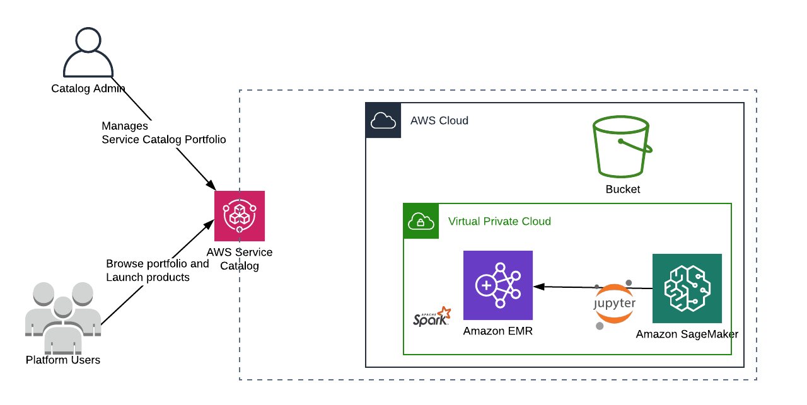

# Ad-hoc Analytics stack

### This is a self contained Ad-hoc analytics stack.

#### Its build on 3 main components

 * Amazon S3
 * Amazon EMR - with Spark
 * Amazon Sagemaker Notebook - with SparkMagic Kernel connecting to EMR cluster

All these are wrapped around a **AWS Service catalog** Portfolio and Product.

